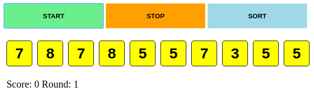
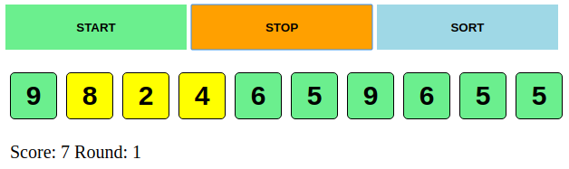
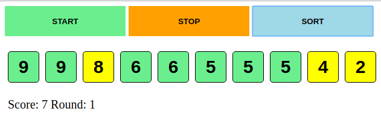
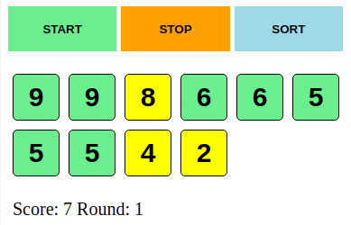

# Praktické zadanie - Kartičky

Výsledkom tohoto zadania bude jednoduchá hra s kartičkami.

Na obrazovke sa bude zobrazovať **10 kariet**, pričom každá z nich bude mať svoju hodnotu **od 1 do 10.** Každých **300ms sa zmení hodnota jednej z kariet.** Užívateľ bude mať možnosť v akomkoľvek okamihu menenie hodnôt zastaviť. V tomto momente **skončí aktuálne kolo a vyhodnotí sa výsledok.** Za každú kartu s hodnotou, ktorá sa nachádza v poli viac ako raz, dostane užívateľ 1 bod.

Napr. za karty **1 1 1 1 1 1 1 1 1 1** dosane užívateľ **10 bodov** (plný počet). Za karty **1 2 3 4 5 6 7 8 9 10** dostane užívateľ **0 bodov** a za karty **1 1 2 2 3 4 5 6 7 8** dostane **4 body.**

Užívateľ bude mať po vyhodnotení kola 2 možnosti:

- Spustiť ďalšie kolo (skóre ostáva).
- Zoradiť si aktuálne zastavené kartičky a skontrolovať tak výsledok manuálne.

Po spustení hry (otvorení daného súboru v prehliadači) sa zobrazia užívateľovi 3 tlačítka - štart, stop, sort  - s vizuálom ako na obrázku.


Po stlačení tlačítka **START** sa zobrazí 10 kartičiek. Každých 300ms sa zmení hodnota jednej z kartičiek.



Po stlačení tlačítka **STOP** sa menenie kartičiek zastaví a vyhodnotí sa aktuálne kolo. Zelenou farbou sa zafarbia kartičky s hodnotou, ktorá sa medzi nimi vyskytuje viac ako raz.



Po tlačení tlačítka **SORT** sa kartičky usporiadajú.



Ďalej je možné opäť spustiť ďalšie kolo tlačítkom **ŠTART**.

## Úloha

Vašou úlohou je doprogramovať časti logiky hry a splniť jednoduché požiadavky na vizuálnu stránku tejto hry. V súbore `practical_task_template.html` je spustiteľná predloha hry, ktorú budete upravovať.

1. Naštýlujte tlačítka, kartičky a zaručte, aby pri zmenšení obrazovky boli stále všetky komponenty viditeľné.
> Napr.
> 

2. Doprogramujte potrebné časti hry, tak aby fungovala ako má. Váš príspevok je nutný všade tam, kde je komentár s popisom, alebo komentár s 3 bodkami: `// ...`.

3. Na miesto metódy `yourSortAlgorithm = (list, compare) => {...}` naimplementujte triediaci algoritmus podľa vašeho výberu a do prvého riadku v danej metóde vložte do komentára jeho časovú zložitosť.

```
class Game {
	...
	yourSortAlgorithm = (list, compare) => {
		// O(...)
		...
	}
}
```
